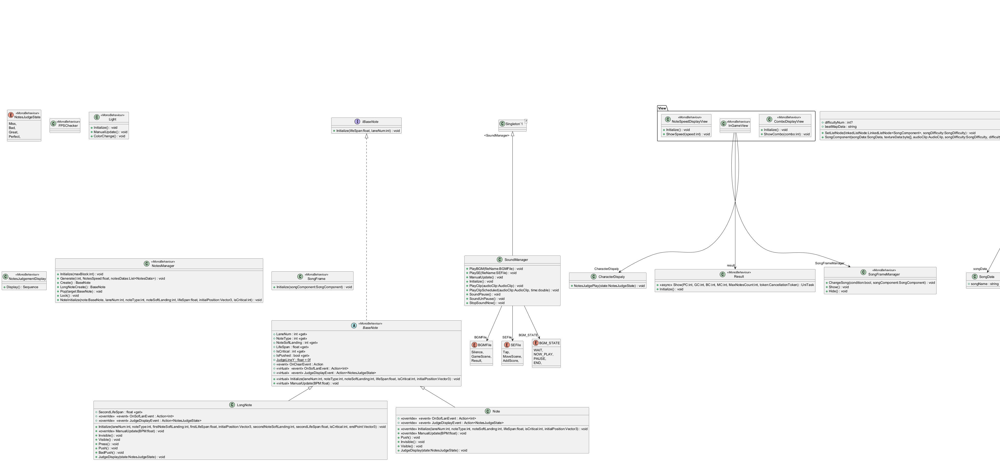
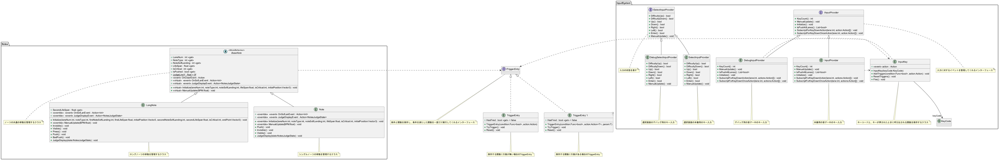
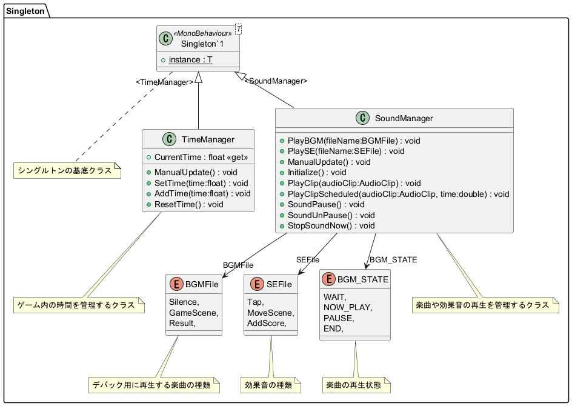
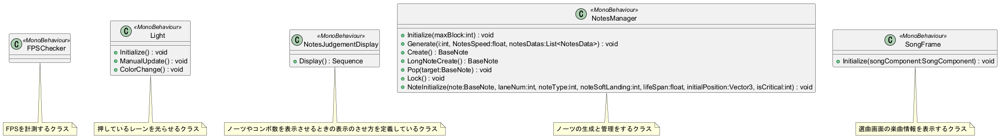

# ROCK-A-SEN

Unityで制作した6keyの音楽ゲームです。

外部ツールで作成した譜面データを読み込み、再生・判定処理を行うシステムを実装しています．

制作期間：約4か月
制作人数：1人（個人制作）
担当：企画・設計・プログラム

## はじめに

このリポジトリには作成した譜面データはありますが、音源のデータは含まれていません．

## プレイ動画

[ROCK-A-SEN プレイ動画 - YouTube](https://youtu.be/gUzBwOtsazY)

## 操作キー一覧

#### 楽曲選択時

| アクション    | キー    |
| -------- | ----- |
| 楽曲の変更    | A / D |
| 難易度の変更   | Q / E |
| ノーツ速度の変更 | W / S |
| 決定       | Enter |

#### 楽曲プレイ中

| アクション | キー  |
| ----- | --- |
| 第一レーン | S   |
| 第二レーン | D   |
| 第三レーン | F   |
| 第四レーン | J   |
| 第五レーン | K   |
| 第六レーン | L   |

## 使い方

`Assets/SongDatas`(ビルド後の場合は`MusicGameTest_Data/SongDatas`)に楽曲の情報を含んだフォルダを配置してから起動をすることでオリジナルの譜面で遊ぶことができます．(SongDatasフォルダが無かったら自分で作ってください！)

### 楽曲の情報のフォルダ構成

```
.
└── SongDatas/
    └── <任意のフォルダ名(楽曲名推奨)>/
        ├── Easy_<難易度の値>/
        │   └── <任意の名前>.json(譜面データ)
        ├── Normal_<難易度の値>/
        │   └── <任意の名前>.json(譜面データ)
        ├── Hard_<難易度の値>/
        │   └── <任意の名前>.json(譜面データ)
        ├── Expert_<難易度の値>/
        │   └── <任意の名前>.json(譜面データ)
        ├── <任意の名前>.png(適当な画像データ)
        ├── <任意の名前>.mp3/.wav(音源)
        └── SongData.json
```

各難易度の譜面を表すフォルダである`Easy_<難易度の値>`,`Normal_<難易度の値>`,`Hard_<難易度の値>`,`Expert_<難易度の値>`は無理してすべて配置する必要はなく、一つの難易度の情報だけで動作します．

#### 一つの難易度だけに対応する楽曲フォルダの例

```
.
└── SongDatas/
    └── <任意のフォルダ名(楽曲名推奨)>/
        ├── Hard_<難易度の値>/
        │   └── <任意の名前>.json(譜面データ)
        ├── <任意の名前>.png(適当な画像データ)
        ├── <任意の名前>.mp3/.wav(音源)
        └── SongData.json
```

### SongData.jsonの内容

```json
{
    "songName": "<楽曲名>"
}
```

## 譜面の作成について

譜面データの作成には、オープンソースの譜面エディタ **NoteEditor** を使用しています．

本リポジトリには **NoteEditor** 本体のソースコードは含まれていません．

NoteEditor が出力する譜面データ形式を解析し、ゲーム内で再生・判定処理を行う部分を自作しています．

> NoteEditor :  [GitHub - setchi/NoteEditor: Note editor for rhythm games. · GitHub](https://github.com/setchi/NoteEditor)

## クラス図









全ての処理は`InGamePresenter`を通して動いているため、`InGamePresenter`はほぼ全てのクラスに依存していますが、クラス図がより見づらくなるため，`InGamePresenter`の依存関係を省略しています．

## ノーツの処理について

ノーツは`linkedlist`を使って制御をしています。理由は`list`だと先頭要素を削除する処理が重いからです．

> 参考記事
> 
> [【C#データ構造】ListとLinkedListの違い](https://zenn.dev/student_blog/articles/a3283f27c384fa)

また、判定の処理を行いやすいように1つのレーンごとに1つの`linkedlist`を用意し、それらを1つの`list`にまとめてます．

そして、ボタンの押されたレーンに対応する`linkedlist`の中から、判定線に最も近い(そのノーツの判定の基準となる時間と、押されたときの楽曲の再生時間の差が最も0に近い)ノーツを対象に処理を行うことで判定を行っています．

## 使用技術

#### R3

イベント管理系のライブラリです．

僕の知っているライブラリを使ってコンボ数の表示を行おうとしたときに、R3の`ReactiveProperty`を使えばコンボ数が変動したことを検知し、画面に表示するという処理が楽に行えそうだったので採用しました．

#### DoTween

アニメーションを手軽に作れるライブラリです．

今回はシーケンスで作った動きを別のクラスで定義して、判定の表示とコンボ数の表示で全く同じ動きを使いまわしたり、リザルト画面の数値の変動のアニメーションに使いました．

#### Zenject(Extenject)

依存性の注入を手伝ってくれるフレームワークです．

これがあると、プロファイルの切り替えみたいなことがクラスでできます．

今回は入力の処理と、完成に時間がかかりそうだったファイルのロードシステムを`interface`経由でアクセスしてとりあえず先に他の機能を作るために使いました．

## 工夫した点

#### 一度だけ関数を呼ぶ処理は面倒くさい

一度だけ、特定の条件を満たした時にある関数を呼ぶ処理を書く時に頭の中で最初によぎるのはメンバ変数を用いてフラグを設定する方法だと思います．

しかし、そういう特定の条件を満たした時一度だけ関数を呼ぶという処理をたくさん書く場合、その処理の数だけ新しいメンバ変数を用意しなければいけません．

なので、<u>条件と関数を格納して条件を満たした時に一度だけ関数を呼んでくれるクラス</u>をAIに案を出してもらい、実装しました．

これのすごいところはこのクラスの`list`を作成してしまえばいくらでも条件を満たした時に一度だけ関数を呼ぶ処理を簡単に記述できる点です．
これ一つでフラグ用のメンバ変数は書かなくてよくなります．

#### ObjectPoolパターンによる使いまわし

FPSゲームの銃の弾みたいなものを打つときに、新しくゲームオブジェクトを作って、使い終わったら消すというのを行わず、あらかじめゲームオブジェクトを必要な分だけ用意しておいて、必要な時に取り出し、必要なくなったらまた使うために取っておくというもの．

FPSゲームの銃の連射のように生成リズムが一定なら`ObjectPool`を使っても使わなくてもあまり処理の重い軽いの違いはわかりづらそうですが、音ゲーのように譜面によって一度に生成するゲームオブジェクトの量に波があると音ゲーの発狂地帯で生成と削除の処理が大量に行われて正常にプレイできなくなりそうだったので`linkedlist`二つで`擬似ObjectPool`を作成しました．

## この作品を作ろうと思った経緯、苦労した点

この作品を作ったきっかけは某PC版の東方の音ゲーの上達を目指すためにsteamで6keyの音ゲーを探していたけど、自分の曲の好みに合わない！ならば自分で作ってしまおう！という思いで作成を始めました。苦労した点は主に4つあります．

1つ目は、音ゲーを作る記事が少なかった点です．
参考になる記事が少なかったので、色々な音ゲーのwikiをみたり、自分の持ってる音ゲーで遊んだりしながら仕様を想像して作っていました。

2つ目は、ロングノーツの実装です．

最初は普通のノーツだけで判定システムを作り、それをもとにロングノーツに対応すれば良いと考えていました．

しかし、ロングノーツには普通のノーツと同様に、ロングノーツの始まりの部分でボタンを押したか？、そこから押し続けているのか？という2段階の判定が必要になり、判定システムが2つに増えてしまいました．

なにより、押しているボタンを途中で離したらミス判定になり、ロングノーツを除去するという処理を考えるのが大変で、ロングノーツ側の処理が複雑化してしまいました．

また、単体ノーツは判定の元になる時間が1つあれば良いですが、ロングノーツは2つ必要であったため、単体ノーツとロングノーツの共通部分の処理を楽にするために作った抽象クラスを継承した、ロングノーツクラスの実装に手間取りました．

3つ目は音ズレの対策です．

NoteEditorは自分で作ったツールではないため、そのツールで作った譜面データを読み取るためには、NoteEditorのプログラムを読む必要がありました。

しかし、音ズレしないための方法については何の情報も得られなかったので、実際に譜面を作って音ズレをしないための調整を何度も行ってようやく対策ができました．

4つ目は外部からのファイルの読み取りです．

外部からファイルを読み取るまでは良かったのですが、そのあとの譜面を難しい順番に並べ替えたり、難易度変更時の移動先を特定したりする処理が大変でした．

特に文化祭の開始までに絶対にこのゲームを完成させる予定だったのですが、文化祭の前日になっても完成せず、このシステムを作って試しているときにNullReferenceExceptionが大量に出てきたときは心が折れかけました．
